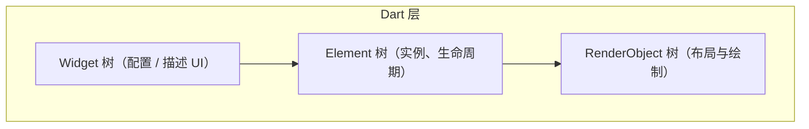

# Flutter 应用架构（学习向）

本文从「运行时如何工作」和「代码如何组织」两个角度概括 Flutter 架构，便于与 `lib/main.dart` 中的示例对照阅读。

## 1. 三层运行时模型（概念）



- **Widget**：不可变描述，类似「UI 的配置」。`build` 返回的是新的 Widget 描述，而不是「可变控件」。
- **Element**：把 Widget 挂到树上，负责复用与更新；`StatefulWidget` 的 `State` 与 Element 关联。
- **RenderObject**：负责布局（layout）、绘制（paint）、命中测试等，贴近屏幕像素。

热重载主要优化的是 **Dart 层 Widget 重建**；与原生视图的桥接由引擎完成，初学者可先记住：**写 Widget，框架负责变成像素**。

## 2. 从入口到界面：`main` → `runApp`

1. `main()` 调用 `runApp(Widget root)`，把根 Widget 交给绑定（binding）。
2. 根 Widget 通常是 `MaterialApp` / `CupertinoApp` / `WidgetsApp`，提供主题、路由、本地化等环境。
3. `home` 或 `routes` 决定首屏；本模板中首屏为 `MyHomePage`。

## 3. StatelessWidget 与 StatefulWidget

| 类型 | 适用场景 | 要点 |
|------|----------|------|
| `StatelessWidget` | 仅依赖父组件传入的数据，无内部可变状态 | 每次 `build` 由父级或 InheritedWidget 等触发 |
| `StatefulWidget` | 需要跨帧保存状态（计数器、开关、输入草稿等） | 状态放在 `State` 子类中，用 `setState` 通知重建 |

**`setState` 的作用**：标记当前 `State` 为脏，在下一帧前会再次调用 `build`，从而更新界面。不要在里面做重计算或异步未完成就假设 UI 已更新。

## 4. 推荐的代码分层（随项目变大再引入）

学习阶段可以全部写在 `lib/` 下；项目变大时常见分层如下，可按需逐步采用：

```
lib/
  main.dart              # 入口、全局 App 配置
  app/                   # 主题、路由、依赖注入入口
  features/<feature>/    # 按业务功能分模块
    presentation/        # 页面、Widget
    domain/              # 实体、用例（可选）
    data/                # API、本地存储（可选）
  core/                  # 通用组件、扩展、错误类型（可选）
```

原则：**UI 与 IO（网络、数据库）解耦**，便于测试和替换实现。小示例不必一次到位。

## 5. 状态管理（扩展阅读）

Flutter 不强制单一方案，常见选择包括：

- **内置**：`setState`、`InheritedWidget`、`ValueNotifier` + `ListenableBuilder` 等。
- **社区方案**：`provider`、`riverpod`、`bloc` 等，适合跨页面共享状态与依赖注入。

本模板仅使用 `setState`，适合先理解 Widget 与生命周期；需要全局状态时再引入包即可。

## 6. 测试与质量

- **单元测试**：`test/` 目录，测试纯 Dart 逻辑。
- **Widget 测试**：`flutter_test`，模拟用户交互与 `find`、`pump`。
- **集成测试**：`integration_test/`（需自行添加），端到端验证。

根目录的 `analysis_options.yaml` 与 `flutter_lints` 帮助保持风格一致，建议保留并随学习逐步理解每条规则。
